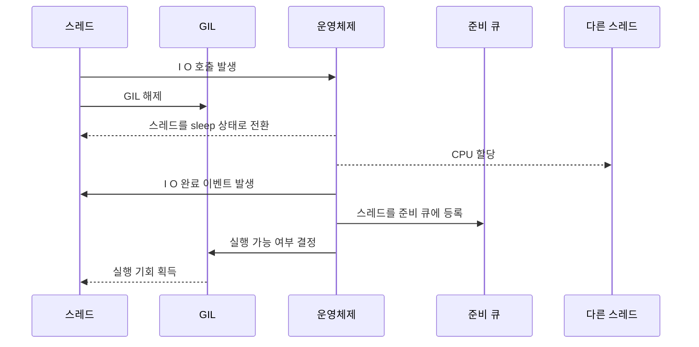

파이썬은 기존 자바와 다른 점이 일부 보인다.

아직 디테일한 부분을 이해하기엔 숙련도가 많이 부족하지만 일부는 공부하고 싶었다.

### 1. 자바와 파이썬에서의 멀티 스레드 활용

자바와 파이썬 모두 멀티스레드를 지원하지만 내부 동작 방식이나 활용 전략이 다른 부분이 있었다. 
파이썬은 CPython 메모리 관리가 thread-safe 하지 않아서 전역 인터프리터 락(GIL, Global Interpreter Lock)으로 관리한다고 한다. 
이로 인해 한 시점에 하나의 스레드만 파이썬 바이트 코드를 실행할 수 있다.

이 과정에서 하나의 스레드가 계속해서 점유하는 문제가 발생하면 기아 문제가 발생할 수 있어서 파이썬 3.x부터 약 5ms마다 GIL을 release하며 이를 방지한다고 함 
결과적으로 파이썬의 멀티스레드는 멀티코어 CPU인 환경에서도 병렬(parallel)이 아닌 동시성(concurrency) 수준에서 동작이 됨 
-> **자바에서는 멀티코어, 멀티스레드 환경이라면 병렬(parallel)적으로 동작한다**는 것에서 다름

다만, 이러한 원리더라도 작업의 성격에 따라 달라지는데 연산 처리(cpu-bound)가 많은 환경에서는 병렬성이 보장되지 않기 때문에 성능 향상이 없는 반면, 
입출력 연산(io-bound)이 발생하면 GIL이 해제되는 원리를 가졌기 때문에 이때에는 다른 스레드가 실행된다고 함 
-> 일부 글을 보면 '이러한 동작 원리로 인해 성능 향상이 된다'는 내용이 있는데 스레드 풀을 이용하던 스프링과 비교하면 결국,, 스레드 기반 확장에 비해 처리량은 부족하지 않을까하는 생각이다 
-> 근데 단순히 다른 전략과 비교하지 않고 GIL만 놓고 본다면 '웹 프레임워크'를 한정으로는 CPU-bound보다 IO-bound가 높으니 유리한 점은 맞다고 본다.

### 2. 동시성 제어 (수정 필요)

`1. 자바와 파이썬에서의 멀티 스레드 활용`의 내용만 본다면 한 시점에 하나의 스레드만 접근 가능하기 때문에 경쟁 상태(race condition)가 발생하지 않을 걸로 생각되는데, GPT말로는 발생할 수 있다고는 한다. 
대략적으로 보면 전역변수를 다루는 상황이나 공유 가변 객체 등에서 발생 가능한 것 같은데 이건 좀 더 알아볼 필요가 있을 것 같다.

### 3. 스케일 아웃 전략

또 정리를 하면서 처리량(throughput)을 늘리려면 결국 스케일 아웃이 필요하다.

근데 결국 멀티 스레드 환경이더라도 ~~싱글 스레드처럼 동작한다면 꽤나 많이 확장을 해야겠다는 생각이 들었다.~~ (cpu-bound일때는 맞지만 io-bound에서는 멀티스레드 동시성 효과를 낸다고 하는데 이 부분은 다시 또 봐야겠다) 
그리고, 파이썬은 자바와 달리 멀티프로세스 모델을 활용하기 때문에 uWSGI나 Gunicorn과 같은 WSGI 서버는 여러 개의 프로세스를 띄워 각 프로세스가 독립된 GIL을 사용하게 함으로써 멀티코어를 활용한다고 한다. 
또한, 워커(worker) 프로세스와 스레드(thread) 수를 직접 개발자가 조정을 해야한다고 한다. 
-> 결국 이렇게 되면 부하 테스트나 서버 스펙을 맞추어야 한다는건데 음,, 

### 4. WSGI

기본적으로 클라이언트의 요청이 오면 워커 내 스레드 풀에서 하나의 스레드를 할당(점유, thread-per-request)하고, `워커=4, 스레드=2`라면 총 8개의 요청을 동시에 처리할 수 있음 
만약, 최대 스레드 수를 벗어난 요청이 오면 스레드를 할당받을 수 없어서 워커 앞에 socket queue(accept queue)를 두어 요청을 대기시킨다고 함 
(uWSGI는 기본적으로 워커앞에 이러한 waiting queue의 역할을 하는 큐를 둔다고 함)

요청은 큐에서 기다리다가 스레드가 비워지면 실행되고, 큐 크기를 초과하면 drop 시키거나 성능 저하나 예외(타임아웃, 응답 지연, 502, 504)가 발생할 수 있음 

**워커**

- WSGI에서 실행되는 프로세스 단위로 각 워커는 독립된 파이썬 인터프리터와 GIL을 갖고 있어서 독립된 메모리 공간을 사용함
  - 멀티코어 CPU를 병렬 처리하려면 결국 워커 수를 늘려야 함

**스레드** 

- 하나의 worker 안에서 동시에 여러 요청을 처리할 수 있게 해주는 실행 단위
- 같은 worker 내부에서는 GIL 때문에 CPU-bound 병렬 실행은 불가능함

**워커 관리**

- WSGI는 마스터 프로세스(Master Process)가 있어서 지정된 수만큼 worker를 실행하고 감시하는 역할을 함
- 즉, worker가 비정상 종료되면 자동으로 다시 띄워주고 설정된 값(Gunicorn, `option -w`)에 따라 워커 수를 관리함

### 5. 스케줄링

생각해보니 io-bound 작업이 발생하면 GIL release를 하면서 다른 스레드가 실행될텐데 io-bound로 밀려난 이 스레드는 어떻게 다시 실행되는거지? 
이를 위한 별도 우선순위 스케줄러가 필요할 것 같은데 , , , , 이건 아래 GPT 답변 참고해가며 더 알아보자.

### 추가 학습 질문 가이드 (by gpt-5)

- Python 3.13에서 논의되는 "no-GIL" 버전은 어떤 방식으로 동작하려고 할까?
- GIL이 존재하는데도 왜 파이썬에서 threading.Lock이나 RLock이 여전히 필요할까?
- 리스트 append나 딕셔너리 update 같은 연산은 원자적(atomic)일까?
- 파이썬의 multiprocessing 모듈은 GIL 문제를 어떻게 회피할까?
- multiprocessing.Pool과 concurrent.futures.ProcessPoolExecutor의 차이는 무엇일까?
- worker 프로세스 간 메모리를 공유하려면 어떤 기법(IPC, 공유 메모리, Queue 등)을 써야 할까?
- 파이썬의 asyncio는 스레드와 어떤 점이 다를까?
- uWSGI에서 worker와 thread 수를 잘못 설정하면 어떤 문제가 생길까?
- --threads 수를 지나치게 늘렸을 때 컨텍스트 스위칭 비용이 왜 성능 저하로 이어질까?
- Linux의 CFS(Completely Fair Scheduler)는 스레드 우선순위를 어떻게 관리할까?
- I/O가 끝난 스레드는 OS에서 어떻게 처리되어 runnable 상태로 복귀할까?
- 자바의 Condition.await()/signal()과 파이썬의 I/O wait/wakeup을 비교했을 때 가장 큰 차이는 무엇일까?
- Django에서 DB 트랜잭션을 동시에 여러 요청이 처리할 때 어떤 동시성 문제가 생길 수 있을까?
- Redis를 파이썬에서 동시성 제어용으로 사용할 때 INCR, DECR 같은 원자 연산을 왜 선호할까?
- 트래픽 급증 상황에서 자바(Spring)와 파이썬(Django)의 스케일 아웃 전략은 실제 운영에서 어떤 차이를 만들까?

---

# GPT 답변 (별도 학습 필요)

## 1. I/O-bound 상황에서 파이썬 스레드 동작
- 파이썬 스레드는 OS 네이티브 스레드이지만, CPython은 GIL(Global Interpreter Lock) 때문에 한 번에 하나의 스레드만 파이썬 바이트코드를 실행할 수 있습니다.  
- 한 스레드가 DB 쿼리, 파일 읽기, 네트워크 요청 같은 블로킹 I/O를 만나면:
  1. 해당 스레드는 커널 레벨에서 **sleep 상태**로 전환됩니다.  
  2. 동시에 GIL을 해제하여 다른 스레드가 실행될 수 있게 합니다.  
  3. OS 스케줄러는 실행 가능한 다른 스레드(runnable thread)에 CPU를 할당합니다.  

## 2. I/O 완료 후 스레드 재실행
- I/O가 완료되면, 커널은 해당 스레드를 깨워 **ready queue(실행 준비 큐)** 에 넣습니다.  
- 이후 OS 스케줄러가 어떤 스레드를 실행할지 결정합니다.  
- CPython은 내부적으로 약 5ms마다 GIL을 양보하기 때문에, 깨어난 스레드는 빠른 시일 내에 실행 기회를 얻게 됩니다.  
- 즉, I/O로 인해 밀려난 작업은 **OS 스케줄러의 공정 정책(CFS 등)** 에 따라 다시 실행되며, 별도의 우선순위 스케줄러가 존재하지는 않습니다.  

---

## 3. 스케줄링 특징
- **우선순위 보장은 없음**
  - CPython이 특별히 "I/O가 끝난 스레드를 우선 실행"하도록 보장하지는 않습니다.  
  - 하지만 Linux CFS 같은 OS 스케줄러는 보통 막 깨어난 I/O 스레드를 빠르게 실행시켜 응답 지연을 줄이려는 성향이 있습니다.  
- **두 가지 레이어가 개입**
  1. **OS 스케줄러**: 어떤 스레드가 CPU를 쓸지 결정  
  2. **GIL 정책**: 동시에 하나의 스레드만 실행되도록 제약, 주기적 양보(5ms)로 공정성 확보  

---

## 4. 실무적 관점
- **I/O-bound 처리**에서는 GIL이 크게 문제되지 않음
  - I/O 대기 시 스레드가 GIL을 반납하므로 다른 스레드가 실행될 수 있음  
  - 여러 요청을 동시에 처리하면서 동시성이 자연스럽게 확보됨  
- **CPU-bound 처리**에서는 GIL이 병목
  - CPU 연산 중에는 GIL 반납이 잘 일어나지 않음  
  - 멀티스레드로도 병렬 실행이 불가능하기 때문에, 멀티프로세스(worker 확장)로 해결해야 함  
